# Ingot diagrams

These diagrams draw ingot **as it is built in this tree**. Where the code
deliberately stops short of the target architecture, the divergence appears as
a labeled annotation at the exact point (a dotted edge in a flowchart, a Note
in a sequence); the target itself lives in [`architecture.md`](./architecture.md).
Service names are lowercase (`ingot`, `sprue`, `piri`, `hilt`,
`indexing-service`), and external services are drawn dashed and opaque with
their contracts on the edges, so the diagram sets piri, sprue, and hilt
publish later can join on the same nodes. Each diagram ends with a `Sources:`
line naming its ground-truth files, and the
[package-to-diagram table](#package-to-diagram-map) at the bottom maps a code
change to the diagrams to re-check. The maintenance rule lives in
[`CLAUDE.md`](../CLAUDE.md).

| id | Diagram | Shows | Home |
|---|---|---|---|
| `context` | [System context](#system-context-services-and-contracts) | every service ingot talks to, and the contract on each edge | here |
| `packages` | [Package map](#package-map-and-interface-seams) | internal packages and the interface seams between them | here |
| `block-routes` | [Two block routes](#two-block-routes-body-blobs-and-catalog-blocks) | how body blobs and catalog blocks travel to Forge by different paths | here |
| `put` | [PutObject](#putobject-spool-and-upload-off-the-lock-commit-under-it) | the write path: off-lock ingest and upload, locked commit | here |
| `get` | [GetObject](#getobject-version-resolution-local-tiers-network-retrieval) | version resolution, tier fallthrough, network retrieval | here |
| `multipart` | [Multipart upload](#multipart-upload-park-on-write-conclude-on-complete) | park at UploadPart, conclude at Complete, abort unwind | here |
| `multipart-states` | [Session states](#session-states-and-the-completeabort-latch) | the session state machine and the single-winner latch | here |
| `blob-lifecycle` | [Blob lifecycle](#blob-lifecycle-spooled-parked-accepted-released) | intent states and the claim ledger gating deletion | here |
| `version-tree` | [Per-key version storage](#per-key-version-storage-manifest-arm-leaf-arm-prev-tree) | the value union, the leaf, the prev tree | here |
| `gc-candidates` | [Catalog GC candidates](#catalog-gc-candidates-what-gets-remembered-for-removal) | every path that records a superseded catalog block for removal | here |
| `principals` | [Principals and proof stores](#principals-and-proof-stores) | every DID in play and which store proves what | here |
| `authorize` | [Request authorization](#request-authorization-and-proof-capture) | the per-request hilt authorize flow and proof capture | here |
| `schema` | [Postgres schema](#postgres-schema-as-migrated) | the `ingot` schema's tables and joins | here |
| `delete-bucket` | [DeleteBucket teardown](#deletebucket-teardown-order) | the teardown ordering across every seam | here |
| `logstore-pipeline` | Catalog pipeline | append, seal, ship, guarded root advance | [`logstore/README.md`](../logstore/README.md#write-path) |
| `segment-states` | Segment lifecycle | open, sealed, shipped, retired, recovery | [`logstore/README.md`](../logstore/README.md#segment-lifecycle) |

## System context: services and contracts

Ingot is an S3 gateway over the Forge network: versitygw serves S3 REST
(`:8080` by default; `:80` in the smelt stack, where `did:web:ingot` resolves
to the listener's `/.well-known/did.json`), hilt authorizes requests and owns
tenancy, sprue brokers every blob
operation, and piri stores and serves the bytes. The indexing-service read
path is designed but unwired; a local locator (over `blob_locations` and
`shard_inclusions`) serves reads instead.

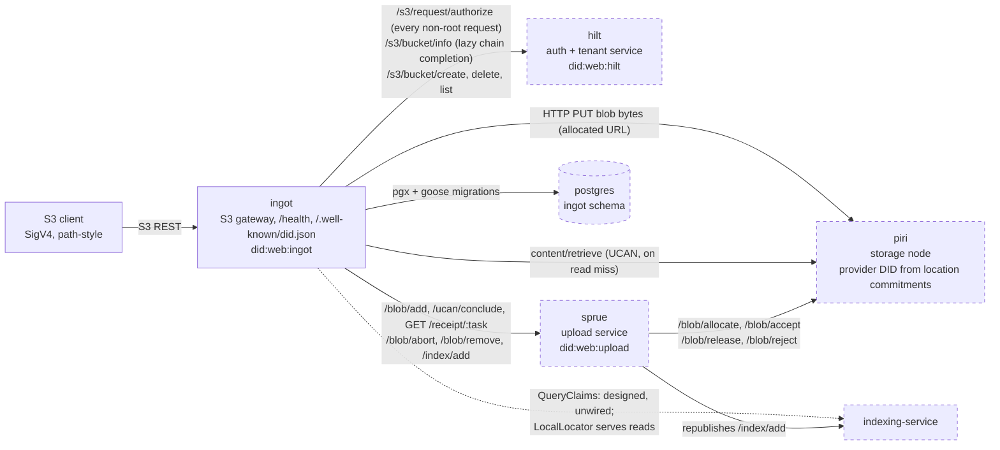

- Ingot never invokes `/blob/accept`: sprue owns accept (and allocate), which
  is why the conclude call carries no space proof.
- The root account (versitygw `RootUserConfig`) bypasses hilt and holds no
  proof store, so it can manage buckets but cannot read through the network
  tier.
- `ListBuckets` is served entirely from hilt; the local `ingot.buckets` table
  backs every other verb.

Cross-references: [`architecture.md` §9](./architecture.md#9-the-system-contract-piri--sprue--indexer)
(the system contract), [§12](./architecture.md#12-implementation-status--postponed-items)
(implementation status).

Sources: `module.go`, `bucketauthority/service.go`, `iam/service.go`,
`forgeclient/`, `uploader/blob.go`, `blockstore/forge.go`. Review when these
change.

## Package map and interface seams

An edge follows the dependency direction; a label names the interface seam
crossed where one stands between the packages. To add an implementation,
satisfy the seam and rewire it in `module.go`.

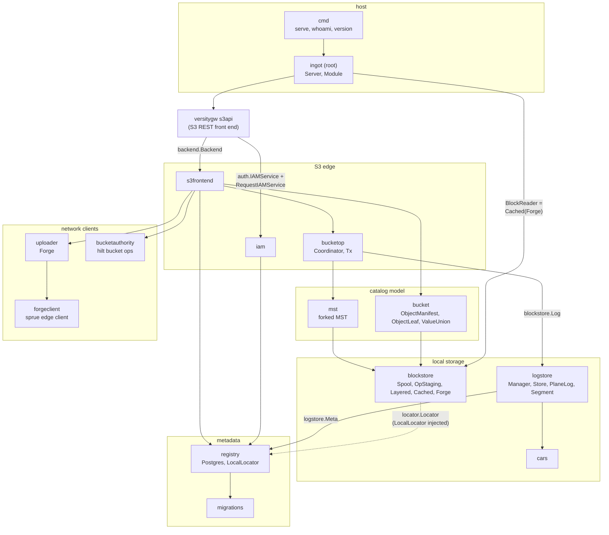

- `registry.Postgres` is one struct satisfying the registry seams
  (`Registry` plus the intent, location, inclusion, blob-ref, GC, multipart,
  and park stores) and `logstore.Meta`.
- `uploader.Forge` is one struct behind `Uploader`, `BodyUploader`,
  `DeferredBodyUploader`, and `BlobRemover`.
- `inmem` (test-only fakes) and `tokenstore` (empty; only the dormant login
  paths would read it) are omitted. `blockstore/locator`'s indexer-backed
  locator compiles but is never injected.
- `iam` and the network tiers never import each other; they meet at
  `internal/reqscope` (the request-scoped proof store, drawn in
  [principals](#principals-and-proof-stores)).

Sources: the `go list` import graph, `module.go`, `server.go`,
`s3frontend/backend.go`. Review on package add/remove or `module.go` provider
changes.

## Two block routes: body blobs and catalog blocks

A write produces two kinds of blocks, and they reach Forge by different
routes. Body blobs travel synchronously, each as its own network object,
before the commit; catalog blocks (MST nodes, manifests, leaf blocks) commit
locally first and ship later, packed into shared CAR segments.

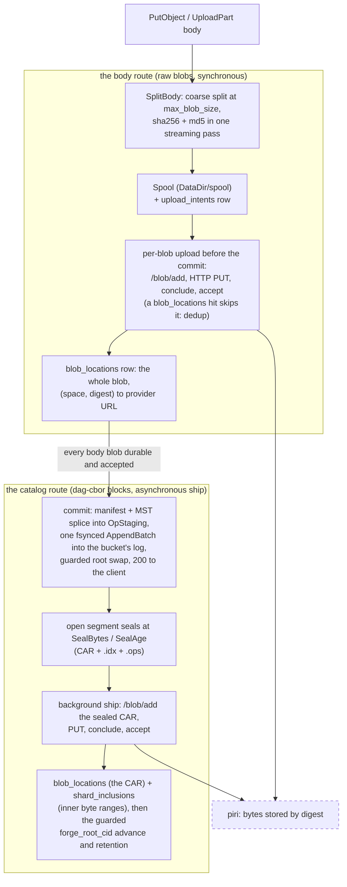

- The `200` means different things per route: body blobs are durable and
  accepted on Forge at ack; the catalog is fsynced locally at ack and becomes
  durable on Forge only when its segment ships (`forge_root_cid` lags
  `root_cid` until then).
- The ordering is the crash-safety invariant: the catalog route starts only
  after every body blob is durable, so a crash never leaves a catalog entry
  pointing at non-durable data.
- The network unit differs: a body blob is retrieved whole by its own digest
  (a `blob_locations` hit); catalog blocks share a CAR, so a network read
  resolves `shard_inclusions` to a byte range inside the shard.
- Reads mirror the split: `OpenBlob` (bodies) checks spool then network,
  skipping the log; `GetBlock` (catalog) checks spool, log, then network
  (the [GetObject diagram](#getobject-version-resolution-local-tiers-network-retrieval)).
- Removal mirrors it too: bodies are reference-counted
  ([blob lifecycle](#blob-lifecycle-spooled-parked-accepted-released));
  superseded catalog blocks queue for a future collector
  ([catalog GC candidates](#catalog-gc-candidates-what-gets-remembered-for-removal)).
- Multipart parts ride the body route with the conclude deferred (parked);
  `Complete` finishes it
  (the [multipart diagram](#multipart-upload-park-on-write-conclude-on-complete)).

Cross-references: [`architecture.md` §4](./architecture.md#4-the-catalog-layer),
[§5](./architecture.md#5-the-data-layer);
[`logstore/README.md`](../logstore/README.md).

Sources: `s3frontend/object.go` (ingestBody), `blockstore/spool.go`,
`blockstore/staging.go`, `logstore/`, `uploader/forge.go`, `uploader/blob.go`,
`server.go` (newBucketFlushFunc). Review when these change.

## PutObject: spool and upload off the lock, commit under it

All network I/O runs outside the per-bucket lock; the critical section is a
manifest write, an MST splice, one fsynced `AppendBatch`, and a guarded root
swap. A `200` means the body is durable and accepted on the network, not
merely buffered.

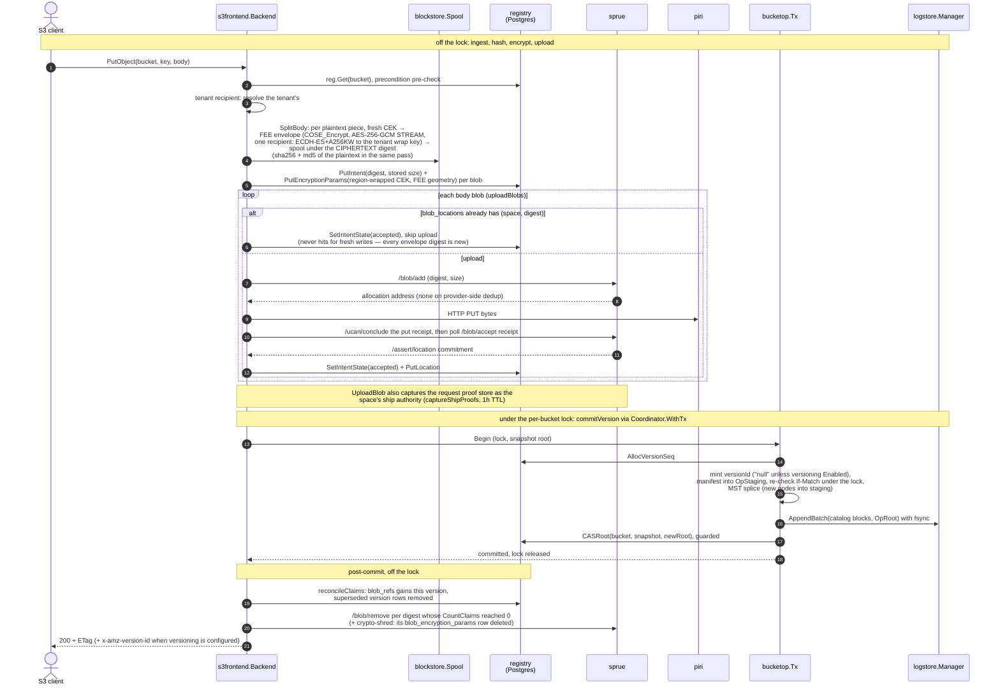

- Encryption makes the stored digest a ciphertext digest: **content dedup is
  gone for bodies** (fresh CEK per write ⇒ unique envelope), by design per
  the encryption RFC. Manifest spans, `Body.Size`, sha256/md5 and ETag stay
  plaintext values; `upload_intents.Size` and `blob_locations.Size` are
  stored (envelope) sizes.
- The envelope's one COSE recipient is the tenant wrap key (kid = the key's
  fingerprint), the RFC's insurance copy: the tenant's private key alone
  recovers the plaintext. The IAM layer stashes the tenant DID from Hilt's
  authorize response on the request; `tenantkey` resolves the `#wrap` key
  from the tenant's did:plc document.
- The supersession rule (which prior version is retained, replaced, or
  discarded) is [`s3-versioning.md`](./s3-versioning.md) §5; the resulting
  storage shape is the [version tree](#per-key-version-storage-manifest-arm-leaf-arm-prev-tree).
- The claim ledger and the zero-claims release are the
  [blob lifecycle](#blob-lifecycle-spooled-parked-accepted-released).
- `CopyObject` runs the same `commitVersion` with a manifest that pins the
  source's digests: no spool, no upload, claims incremented. Cross-space
  (today: cross-bucket) copies are rejected `NotImplemented` — the CEK wrap
  is bound to (space, digest), so they need a rewrap flow.
- Supersession also records each replaced catalog block for future removal:
  the [catalog GC candidates](#catalog-gc-candidates-what-gets-remembered-for-removal)
  diagram shows every entry path.

Cross-references: [`architecture.md` §7.1](./architecture.md#71-write-single-shot-putobject).

Sources: `s3frontend/object.go` (PutObject, ingestBody, uploadBlobs),
`s3frontend/version.go` (commitVersion), `bucketop/bucketop.go`,
`blockstore/staging.go`, `uploader/blob.go`, `uploader/forge.go`. Review when
these change.

## GetObject: version resolution, local tiers, network retrieval

A read resolves the version through the MST, then serves each covering blob
from the first tier that has it: spool, the catalog log (catalog blocks
only), then the network. Network resolution goes through the local locator
tables, never the indexing-service.

```mermaid
sequenceDiagram
    autonumber
    actor C as S3 client
    participant B as s3frontend.Backend
    participant R as registry<br/>(Postgres)
    participant LY as blockstore.Layered
    participant LG as logstore.Manager
    participant LC as registry.LocalLocator
    participant K as regionkey.Provider<br/>(OpenBao / in-process)
    participant P as piri

    C->>B: GetObject(bucket, key, versionId?)
    B->>R: reg.Get(bucket): space, root, versioning
    B->>LY: resolveVersion: MST get(key), decode the value union
    alt manifest-valued key
        Note over B,LY: the value block is the manifest<br/>(answers every versionId class)
    else leaf-valued key
        Note over B,LY: Current for the head, otherwise seek the prev tree at<br/>revSeqKey(seq) and confirm the stored VersionID (see version-tree)
    end
    Note over B: delete marker: 404 NoSuchKey (current) or 405 (versioned),<br/>then preconditions and selectBytes (Range, or partNumber via Body.PartSizes)
    B->>R: bodyOpener: blob_encryption_params + blob_locations per blob<br/>(row existence = encrypted)
    loop each covering blob or catalog block
        opt encrypted blob (FEE)
            B->>K: Unwrap region-wrapped CEK, bound to (space, digest)
            Note over B: aesstream.CiphertextRange maps the plaintext range to<br/>one contiguous ciphertext span past the envelope header
        end
        B->>LY: read (whole blob, or only the ciphertext span via OpenBlobRange)
        alt spool hit
            LY-->>B: bytes from the spool
        else catalog log hit (GetBlock only)
            LY->>LG: Get: linear scan of open bucket stores
            LG-->>B: block from an open or sealed segment
        else network (blockstore.Forge)
            LY->>LC: Locate(space, digest)
            alt whole blob in blob_locations
                LC-->>LY: provider URL + whole-blob range
            else inner block via shard_inclusions
                LC-->>LY: shard location + inclusive byte range
            end
            LY->>P: content/retrieve (UCAN, audience = the commitment's provider,<br/>proofs from reqscope.ProofStore, absent for root;<br/>narrowed to the ciphertext span for an encrypted blob)
            P-->>LY: ranged bytes, length-checked
        end
        opt encrypted blob (FEE)
            Note over B: aesstream.SpanReader decrypts the span as it streams;<br/>a tampered chunk fails authentication mid-stream (ErrCorrupted)
        end
    end
    B-->>C: 200 or 206 body (plaintext byte counts throughout)
```

- `OpenBlob` (body blobs) checks spool then network; only `GetBlock`
  (catalog blocks) consults the log tier, and only `GetBlock` is fronted by
  the `Cached` LRU.
- A root-account read has no request proof store, so it works only while the
  blocks are local.
- The indexer-backed locator (`blockstore/locator`) compiles but is never
  injected; `module.go` always wires `LocalLocator`.
- Manifest coordinates are plaintext: `BlobRef.Start/End`, `Body.Size`,
  ETag and Content-Length never change with encryption. `BlobRef.Digest`
  names the stored — for an encrypted blob, ciphertext — bytes; only the
  per-blob open translates between the two.
- HEAD needs no decryption at all (every value it reports is a plaintext
  manifest field).

Cross-references: [`architecture.md` §7.4](./architecture.md#74-read-getobject),
[§8](./architecture.md#8-retrieval-addressing-when-bodies-need-a-sharded-dag-index).

Sources: `s3frontend/object.go` (GetObject, HeadObject, selectBytes),
`s3frontend/version.go` (resolveVersion), `s3frontend/decrypt.go`
(bodyOpener, decryptingOpener), `bucket/chunker.go` (BlobRangeOpener),
`blockstore/layered.go`,
`blockstore/forge.go` (doRetrieve), `blockstore/cache.go`,
`registry/locallocator.go`, `logstore/manager.go` (Get). Review when these
change.

## Multipart upload: park on write, conclude on Complete

Parts upload to the provider at `UploadPart` but stay **parked** (durable,
unaccepted): the conclude that triggers `/blob/accept` is deferred to
`Complete`, so an `Abort` only ever unwinds parked blobs.

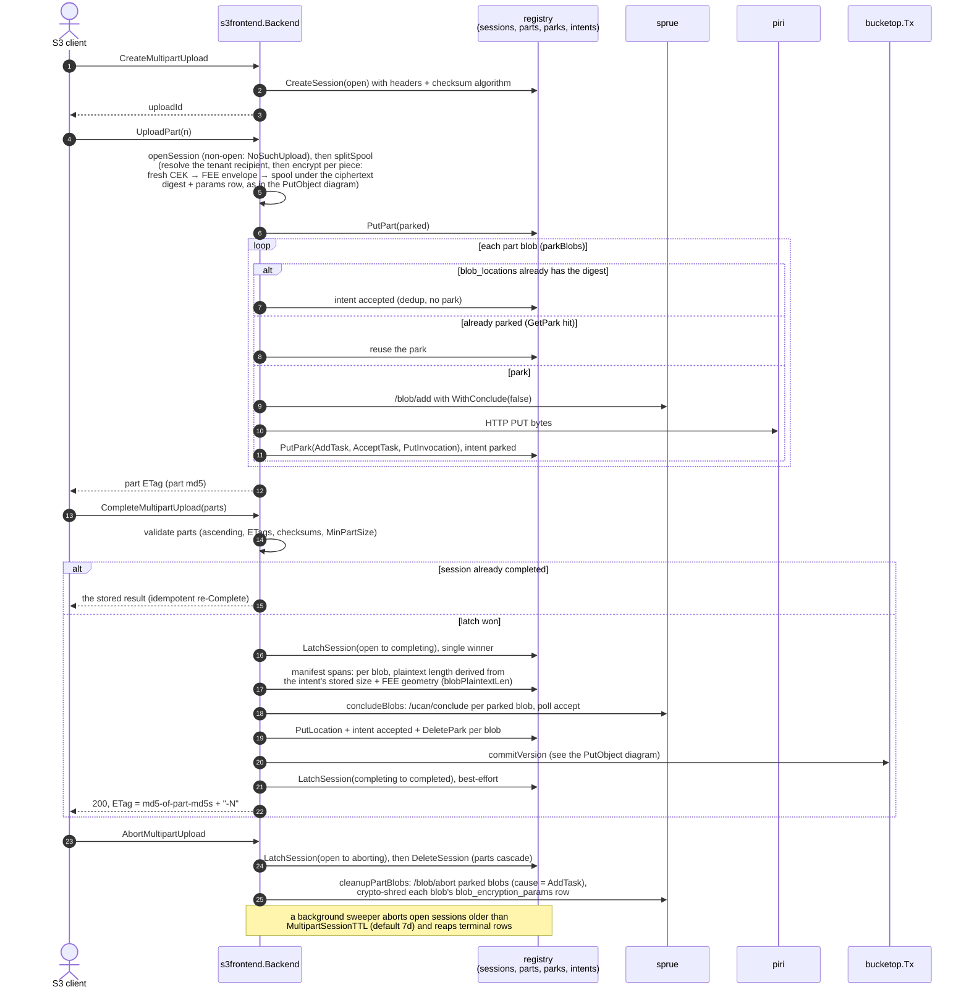

- A part re-upload and an abort reclaim only blobs no other session, part, or
  committed object references (`cleanupPartBlobs` checks `CountPartRefs` and
  `CountClaims`).
- A never-parked blob at Complete falls back to a full synchronous
  `UploadBlob`.

Cross-references: [`architecture.md` §7.2](./architecture.md#72-multipart),
[§7.3](./architecture.md#73-the-session-latch-the-abortcomplete-race).

Sources: `s3frontend/multipart.go` (all verbs, parkBlobs, concludeBlobs,
cleanupPartBlobs, SweepStaleMultipartSessions), `registry/stores.go`,
`server.go` (startMultipartSweeper). Review when these change.

## Session states and the Complete/Abort latch

The latch is one guarded update: `UPDATE multipart_sessions SET state = $3
WHERE upload_id = $1 AND state = $2`; exactly one caller sees
`RowsAffected == 1`.

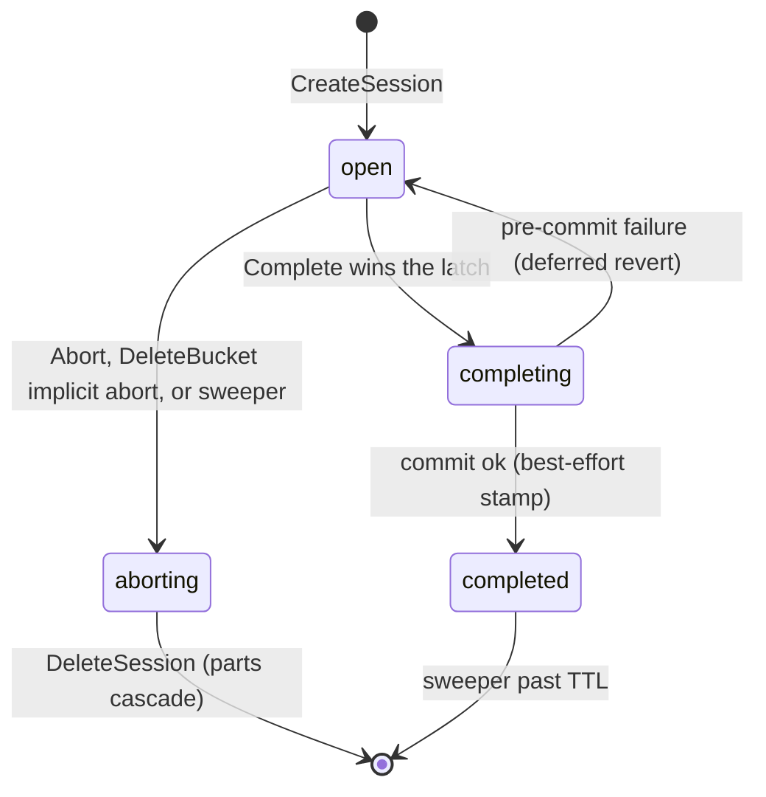

- There is no wait-for-in-flight: a racing Complete either sees `completed`
  (and returns the stored result) or loses the latch and gets `NoSuchUpload`.
- `ListParts` and `Abort` reject any non-`open` session as `NoSuchUpload`;
  `Complete` alone accepts `completed`, for idempotency.
- The sweeper also reaps rows stuck in `completing` or `aborting` past the
  TTL.

Sources: `s3frontend/multipart.go`, `registry/stores_postgres.go`
(LatchSession). Review when these change.

## Blob lifecycle: spooled, parked, accepted, released

Dedup stores bytes once; the claim ledger lets them be deleted once. Intents
track the disk-and-network state of each digest; `blob_refs` counts which
versions still reference it.

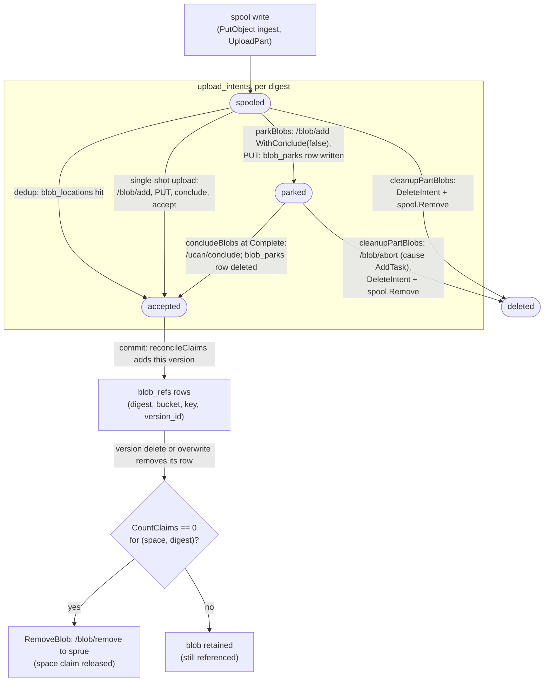

- `published` is a declared intent state no code writes today; `blob_parks`
  is a presence machine (a row exists while a conclude is owed), not a state
  column.
- Digests present in both the old and new version sets never churn: the
  reconcile computes a set difference.
- Parked-blob reclamation is guarded: a digest live in another session, part,
  or committed object is left alone.

Cross-references: [`architecture.md` §5](./architecture.md#5-the-data-layer),
[`s3-versioning.md`](./s3-versioning.md) §8.

Sources: `registry/stores.go` (state consts), `s3frontend/object.go`
(ingestBody, reconcileClaims, releaseBlobs), `s3frontend/multipart.go`
(parkBlobs, concludeBlobs, cleanupPartBlobs), `uploader/blob.go` (UploadBlob,
AbortBlob, RemoveBlob). Review when these change.

## Per-key version storage: manifest arm, leaf arm, prev tree

Every catalog value block is a keyed union naming its own format. A key holds
its manifest directly until its first retained supersession, then gains an
`ObjectLeaf` and keeps it for the rest of its life.

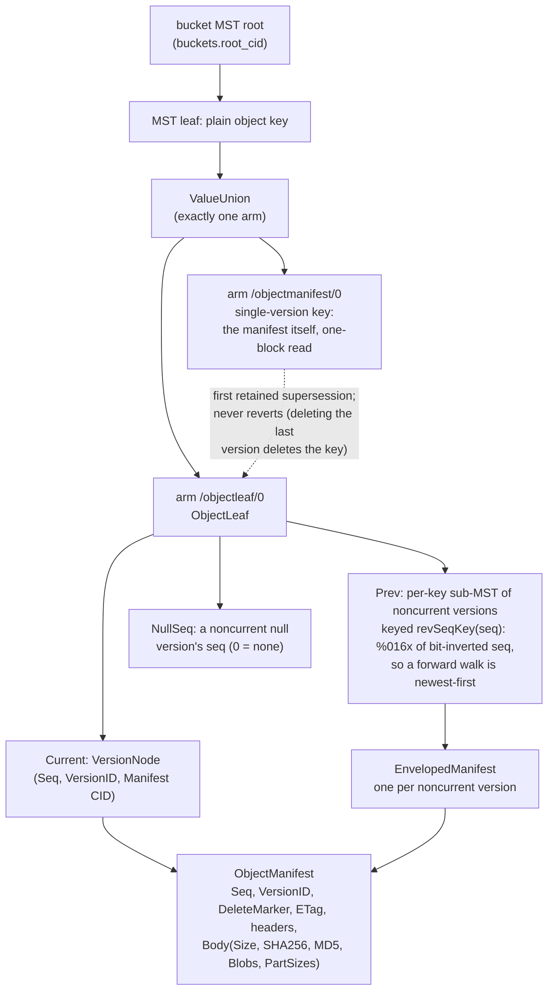

- At most one null version exists per key; it may sit anywhere in the stack,
  and `NullSeq` locates (and lets a new null evict) a noncurrent one.
- The version token is a ULID whose low bytes embed the seq, but the embedded
  seq is only a locator hint: resolution always confirms the stored
  `VersionID`.
- Deleting the current version promotes the prev-tree head into a new leaf
  (clearing `NullSeq` when the promoted seq was the null); deleting the last
  version deletes the key.
- The bucket versioning state itself is three values with one guarded SQL
  update: `unversioned` moves to `enabled` or `suspended`, which then toggle;
  there is no path back to `unversioned`.
- Blocks this tree sheds (replaced leaf blocks, discarded manifests) are
  recorded for future removal; the entry paths are the
  [catalog GC candidates](#catalog-gc-candidates-what-gets-remembered-for-removal)
  diagram.

Cross-references: [`s3-versioning.md`](./s3-versioning.md) (the full design:
value union §2.1, prev tree §2.2, token §3, write rule §5, deletes §7);
[`architecture.md` §4](./architecture.md#4-the-catalog-layer) keeps the ASCII
manifest figure this complements.

Sources: `bucket/leaf.go`, `bucket/manifest.go`, `s3frontend/version.go`
(mintVersionID, revSeqKey, commitVersion, deleteVersionScoped). Review when
`bucket/` types change (and re-run `make gen`).

## Catalog GC candidates: what gets remembered for removal

`gc_candidates` is the memory of the catalog collector to come: every write
that supersedes a catalog block records that block's CID here, inside the
commit critical section, so nothing the tree sheds is ever forgotten. Nothing
consumes the table yet.

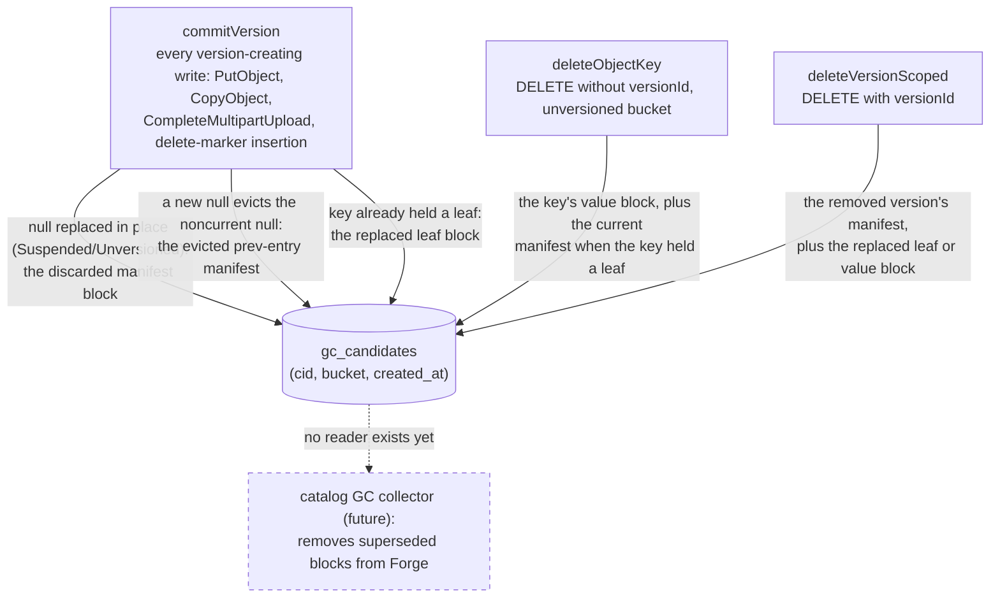

- Recording is mandatory, never best-effort: the inserts run inside the
  per-bucket commit closure, so a failed insert fails the whole write before
  the root swap.
- A retained supersession queues only the replaced **leaf block**; the old
  manifest is not queued because it lives on as a prev-tree entry. Only
  blocks nothing references anymore land here.
- As built, the table holds superseded **value blocks** (manifests and leaf
  blocks). Interior MST path nodes rewritten by a splice are not recorded;
  [`architecture.md` §4](./architecture.md#4-the-catalog-layer) scopes the
  eventual collector to those as well.
- The body bytes a removed version referenced are handled separately, by the
  claim ledger in the
  [blob lifecycle](#blob-lifecycle-spooled-parked-accepted-released):
  `gc_candidates` remembers catalog blocks, `blob_refs` counts body blobs.

Cross-references: [`architecture.md` §4](./architecture.md#4-the-catalog-layer),
[`s3-versioning.md`](./s3-versioning.md) §7.

Sources: `s3frontend/version.go` (commitVersion supersession,
deleteVersionScoped), `s3frontend/object.go` (deleteObjectKey),
`registry/stores_postgres.go` (AddGCCandidate). Review when these change.

## Principals and proof stores

The agent signs every outbound invocation, but the authority to act on a
space arrives per request: hilt re-delegates the access key's grant to the
agent, the IAM layer caches it per access key, and `internal/reqscope`
carries it into the write and read paths.

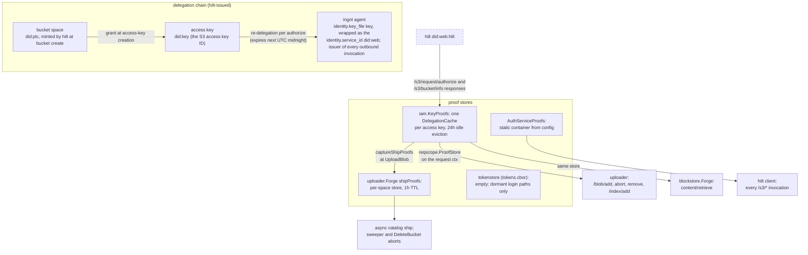

- The piri provider DID is never configured: retrieval audiences come from
  the `/assert/location` commitment each read resolves.
- The root account holds no proof store: bucket administration works, network
  reads and space-scoped writes do not.
- A bucket whose last write is more than an hour old has an expired ship
  authority; a newly sealed segment then waits for the bucket's next write to
  re-capture it.
- Each access key gets its own `DelegationCache`, so a proof chain can never
  assemble across keys.

Cross-references: [`architecture.md` §9](./architecture.md#9-the-system-contract-piri--sprue--indexer).

Sources: `iam/service.go`, `iam/keyproofs.go`, `iam/proofcache.go`,
`internal/reqscope/reqscope.go`, `uploader/forge.go` (shipProofs,
captureShipProofs), `module.go`, `config/config.go` (auth_service fields).
Review when these change.

## Request authorization and proof capture

Every non-root request is authorized against hilt (or its cached
delegations), and the proofs captured here are what the rest of the request
spends.

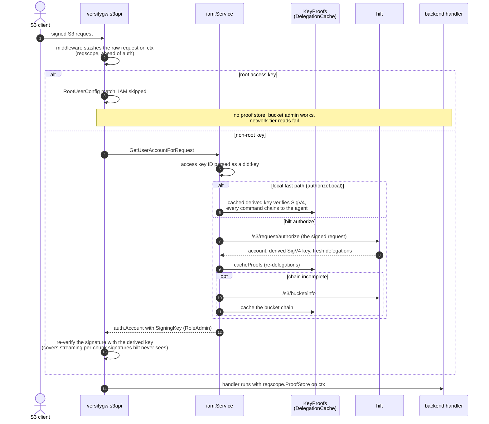

- `RoleAdmin` is deliberate: authorization already happened (at hilt or the
  fast path), so versitygw's role and ACL layers must defer entirely.
- Authorize failures map to S3 errors in `mapAuthError`; unrecognized errors
  stay 500-class on purpose.
- The signing key never leaves hilt as a secret: ingot receives a derived
  SigV4 key per request (the versitygw fork's `auth.Account.SigningKey`).

Sources: `iam/service.go` (GetUserAccountForRequest, authorizeLocal,
cacheProofs, mapAuthError), `server.go` (buildS3API middleware). Review when
`iam/` or the hilt client changes.

## Postgres schema as migrated

Everything relational lives in the `ingot` schema; manifests and MST nodes
are content-addressed blocks in the catalog log, not rows. Attributes here
are trimmed to keys, states, and the columns other diagrams reference; the
full DDL is `migrations/sql/`.

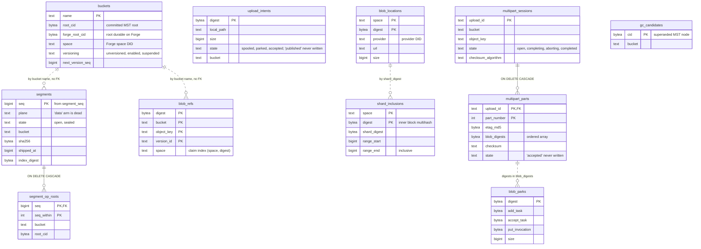

- The two solid relationships are the schema's only real foreign keys;
  dashed ones are soft joins the code performs.
- `gc_candidates` is write-only (no reader exists yet; its entry paths are the
  [catalog GC candidates](#catalog-gc-candidates-what-gets-remembered-for-removal)
  diagram); `segments.plane`
  still CHECK-allows the deleted `data` arm; `upload_intents.published` and
  `multipart_parts.accepted` are CHECK arms no code writes.
- Session rows also carry the passthrough HTTP headers and checksum columns
  Complete writes into the manifest; intent and location rows carry
  timestamps. See the DDL for the full column lists.

Cross-references: [`architecture.md` Appendix C](./architecture.md#appendix-c--postgres-schema-the-ingot-schema)
(the annotated DDL).

Sources: `migrations/sql/*.sql`. Review whenever a migration is added.

## DeleteBucket teardown order

Teardown crosses every seam in order: prove the bucket empty, unwind
in-flight multipart, quiesce the log, release every network registration,
then delete at hilt and locally.

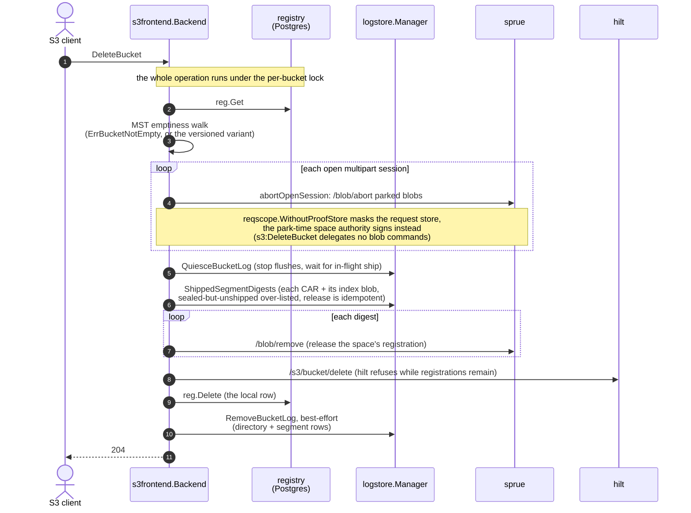

- The log seams (`QuiesceBucketLog`, `ShippedSegmentDigests`,
  `RemoveBucketLog`) are type-asserted on `blockstore.Log`: a plain `Store`
  without them silently no-ops, which is the trap this diagram documents.
- A failure after the quiesce leaves the bucket functional: the closed store
  reopens lazily on the next use.

Sources: `s3frontend/bucket.go` (DeleteBucket), `s3frontend/multipart.go`
(abortOpenSession), `logstore/manager.go`. Review when these change.

## Package-to-diagram map

The review table for changes: find the package you touched, re-check the
listed diagrams (each diagram's `Sources:` footer names its exact files).

| Package / file | Diagrams to review |
|---|---|
| `s3frontend/object.go`, `s3frontend/version.go` | put, get, blob-lifecycle, version-tree, gc-candidates |
| `s3frontend/multipart.go` | multipart, multipart-states, blob-lifecycle |
| `s3frontend/bucket.go` | context, delete-bucket |
| `bucketop/` | put, get, delete-bucket, packages |
| `blockstore/` | get, packages, block-routes; `forge.go` also context, principals |
| `registry/` | schema, get, blob-lifecycle, logstore-pipeline |
| `logstore/` | logstore-pipeline, segment-states, get, block-routes, delete-bucket |
| `uploader/`, `forgeclient/` | context, put, multipart, principals, logstore-pipeline, block-routes |
| `iam/`, `internal/reqscope/` | principals, authorize, context |
| `bucket/`, `mst/` | version-tree, put, get |
| `migrations/sql/` | schema, plus any state diagram naming a changed CHECK |
| `module.go`, `server.go`, `config/` | packages, context, logstore-pipeline |
