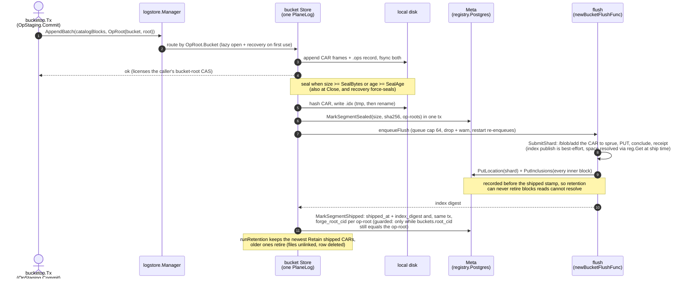
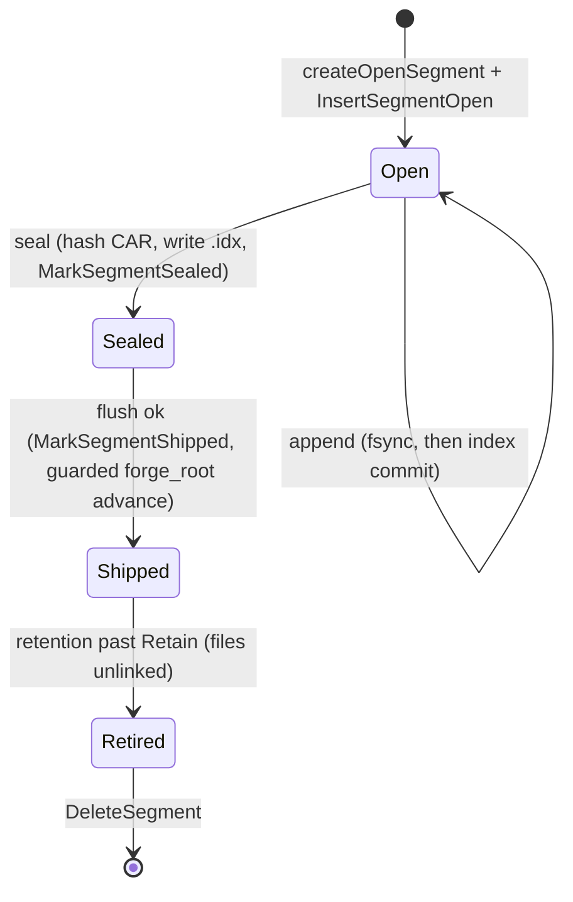

# logstore

`logstore` is ingot's **catalog journal**: the local, durable tier between the
S3 write path and the Forge network. Every S3 mutation's catalog blocks (the
dag-cbor MST nodes and `ObjectManifest`s) land here first (`AppendBatch`), are
fsynced to disk before the write is acked, and are later **sealed** and
**shipped** to Forge asynchronously. Reads consult the journal before falling
through to the network blockstore.

The log holds only the catalog. Object bodies are never journaled: they are
spooled and uploaded to Forge per blob before the catalog commit (see
`blockstore.Spool` and [`../docs/architecture.md`](../docs/architecture.md) §7.1),
so the data plane an earlier iteration shipped through this package is gone.

The log is **segregated per bucket**. `Manager` implements `blockstore.Log`
and owns one `Store` per bucket, each rooted under its own directory, so a
sealed segment holds exactly one bucket's blocks and ships to that bucket's
Forge space. A `Store` is a thin wrapper over one `PlaneLog`, the reusable
pipeline (seal trigger, ship transport, retention window). `AppendBatch`
routes by the op-root's bucket, lazily opening (and recovering) that bucket's
store on first write; `OpenManager` re-opens every bucket with leftover
segments at startup (the union of on-disk directories and segment rows), so
unshipped sealed segments re-enqueue without waiting for the bucket's next
write.

The persistence backend (`Meta`) is `*registry.Postgres` in production and an
in-memory fake in tests; logstore never touches SQL directly. The two diagrams
below belong to the ingot diagram set; the set's index is
[`../docs/diagrams.md`](../docs/diagrams.md).

## On-disk layout

Each bucket owns a subdirectory; a segment is a single CAR plus its `.idx` and
`.ops` sidecars:

```
<DataDir>/segments/
  <bucket>/
    catalog/
      seg-<N>.car   seg-<N>.idx   seg-<N>.ops
```

| File | Contents |
|---|---|
| `seg-N.car` | CARv1 of the segment's dag-cbor blocks |
| `seg-N.idx` | JSON sidecar: `cid` to `offset,length`, size, sha256, sealed_at, op-roots |
| `seg-N.ops` | append-only log of per-batch `(bucket, newRoot)` records (length-prefixed CBOR) |

`N` is the zero-padded segment id from one **shared** allocator
(`ingot.segment_seq`), so ids are globally unique across buckets; the segment
row's `bucket` column names the owner. Each CAR carries a placeholder header
root; the real MST roots live in the `.ops` sidecar (and the `.idx`).

## Write path



A batch may be empty of blocks: an MST mutation can produce a new root that
points only at nodes already materialized in a prior segment, so `AppendBatch`
is called with the op-root alone. A flush error keeps the segment unshipped
and retried (5 attempts, backoff 1s doubling to a 30s cap); a bucket deleted
while segments were queued has nowhere to ship, so the closure returns nil and
the segment marks shipped and retires.

## Segment lifecycle



- The DB `state` column holds only `open` and `sealed`. Shipped is the
  `shipped_at` stamp (plus `index_digest`); retired is file absence.
- With `Ship=false` a segment stays sealed on disk forever: the only durable
  copy and the sole source for local reads.
- Recovery force-seals any recovered open segment, so each process starts
  with a brand-new open segment per bucket.

## Invariants

- **Durability before ack.** `Segment.append` fsyncs the CAR and `.ops` before
  committing the in-memory index, and a successful `AppendBatch` is what
  licenses the caller's bucket-root CAS. Body blobs are already durable and
  accepted on Forge before the commit that references them, so a crash never
  leaves a durable catalog entry pointing at non-durable data.
- **One bucket per segment.** The log is segregated per bucket; every segment
  ships to its own bucket's Forge space, and `DeleteBucket` can quiesce and
  release exactly one bucket's registrations.
- **`forge_root_cid` advances only on ship, and only guarded.**
  `MarkSegmentShipped` advances each op-root's bucket row in the same
  transaction as the shipped stamp, and only where `buckets.root_cid` still
  equals the op-root (the orphan-root guard).
- **Location before shipped.** The flush records the shard's location and
  every inner block's byte range (`blob_locations` + `shard_inclusions`)
  before the shipped stamp, so retention can never retire blocks the read
  tier cannot resolve.
- **The catalog is location-free.** Manifests and MST nodes reference content
  only by CID; byte location resolves at read time through the locator, never
  embedded in the DAG.

## Reads & tiers

`Manager.Get` consults every open bucket store and returns the first hit;
reads carry no bucket context today, so the lookup is linear in open buckets
(threading the bucket into the read path is the follow-up that removes the
scan). Each store checks its open segment, then its sealed segments
newest-first (`ReadAt` on the CAR). A miss, including a segment retired off
disk, returns `ErrNotFound`, and the layered reader (`blockstore.Layered`)
falls through to the network tier (`blockstore.Forge`: locate via the local
location/inclusion tables, then a ranged piri `content/retrieve`). LSM tiers:
**hot** is the open segment, **warm** is sealed-and-local, **cold** is shipped
(served from Forge once retired).

## Crash recovery

Opening a bucket's store reconciles its directory against the `Meta` rows
before any worker starts. Discovery keys on the CAR file:

| `Meta` row | On-disk CAR | Action |
|---|---|---|
| `open` | present | `rebuildOpenFromDisk` (scan + truncate any torn trailing frame); then force-sealed |
| `sealed` | present | `loadSealedFromIdx`; re-enqueue when shipping and not yet shipped |
| none | present | orphan (crashed before the row): rebuild as open + `InsertSegmentOpen`, then force-sealed |
| present | absent | delete the row |
| — | sidecar only (`.idx`/`.ops`, no CAR) | stray; unlink |

## Configuration

```go
type ManagerConfig struct {
    Dir      string                        // bucket b's segments live under <Dir>/<b>/
    Meta     Meta                          // persistence backend (registry.Postgres / fake)
    Catalog  PlaneConfig                   // pipeline template applied to every bucket store
    FlushFor func(bucket string) FlushFunc // per-bucket ship closure; required when Catalog.Ship
    Logger   *zap.Logger
}

type PlaneConfig struct {
    SealBytes int64         // open-segment CAR size threshold (0 -> 64 MiB)
    SealAge   time.Duration // max open age before sealing (0 -> 5s); ticker paces at SealAge/4
    Ship      bool          // false -> never ship, retained forever
    Flush     FlushFunc     // ships one sealed CAR; set by the Manager from FlushFor
    Retain    int           // shipped CARs kept locally (0 -> 6); ignored when !Ship
}
```

The host (`server.go`) binds the per-bucket ship closure via
`newBucketFlushFunc(uploader, registry, locations, inclusions, bucket)`, which
builds a `uploader.CARShard` from the `Segment` accessors, calls
`uploader.SubmitShard`, and records the location/inclusion rows.

## Key symbols

| Where | Symbols |
|---|---|
| `manager.go` | `Manager` (per-bucket log, the production `blockstore.Log`): `OpenManager`, `AppendBatch`, `Get`, `Close`; `QuiesceBucketLog`, `ShippedSegmentDigests`, `RemoveBucketLog` (DeleteBucket's seams) |
| `store.go` | `Store` (one bucket's catalog log): `Open`, `AppendBatch`, `Get`, `Close` |
| `planelog.go` | `PlaneLog` (the pipeline): `openPlaneLog`, `Append`, `Get`, `Close`; `sealOpenIfDue`, `flushLoop`, `flushOne`, `runRetention`, `sealTickerLoop` |
| `segment.go` | `Segment`: `createOpenSegment`, `append`, `seal`, `markShipped`, `retire`, `get`; `.idx`/`.ops` codecs |
| `recovery.go` | `(*PlaneLog).recover` (disk vs `Meta` reconciliation for one bucket store) |
| `types.go` | `State`, `SegmentMeta`, `Meta` |
| `config.go` | `Config`, `ManagerConfig`, `PlaneConfig`, `FlushFunc` |
| `../server.go` | `newBucketFlushFunc` (per-bucket flush: `uploader.SubmitShard` + location/inclusion rows) |
| `../uploader/forge.go` | `Uploader`, `CARShard`, `Forge.SubmitShard` |
