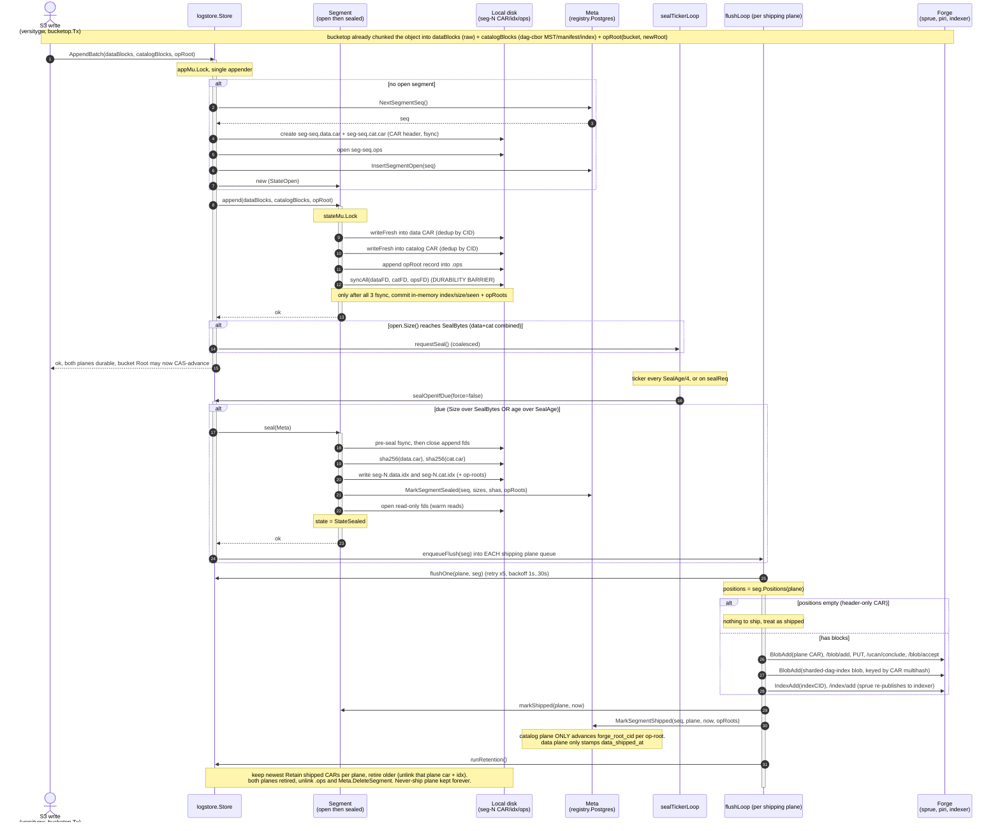
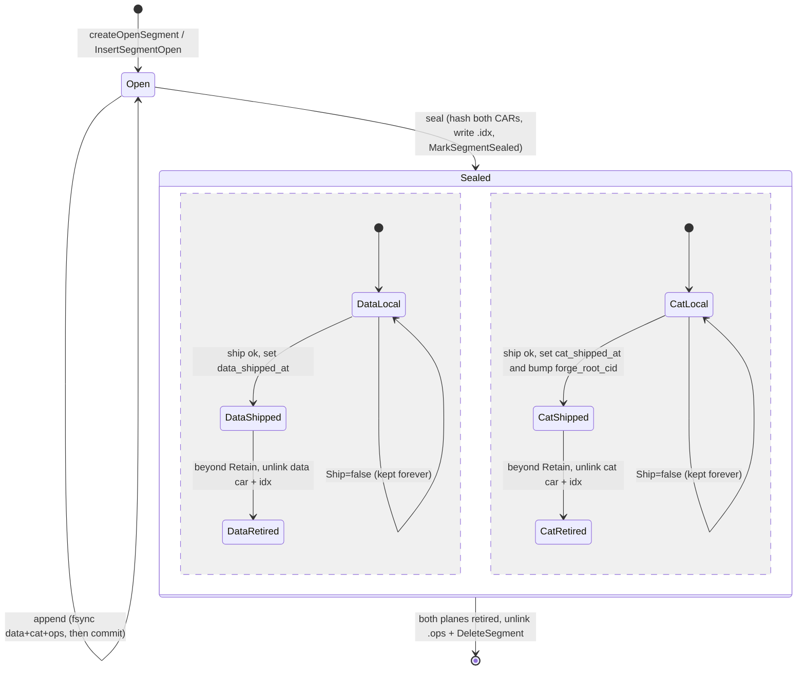

# logstore

`logstore` is ingot's **LSM-style journal** — the local, durable tier between the
S3 write path and the Forge network. Every S3 mutation lands here first
(`AppendBatch`), is fsynced to disk before the write is acked, and is later
**sealed** and **shipped** to Forge asynchronously. Reads consult the journal
(open segment, then sealed segments newest-first) before falling through to the
network blockstore.

A segment splits into **two planes** that ship through **independent pipelines**:

- **data plane** — raw-codec object-body chunks (the bytes a client GETs).
- **catalog plane** — the dag-cbor MST nodes, `ObjectManifest`s, and chunk
  indexes describing where the body bytes live and how to reconstruct an object.

Blocks are classified by CID codec at staging time (`cid.Raw` to data, dag-cbor
to catalog; see `OpStaging.Put`). Each plane is its own CAR file with an
independent ship/retain lifecycle: a plane configured `Ship=false` never goes to
Forge and is retained on local disk forever, while a `Ship=true` plane ships each
sealed CAR and retires shipped CARs beyond its `Retain` window.

`*Store` implements `blockstore.Log`. The persistence backend (`Meta`) is
`*registry.Postgres` in production and an in-memory fake in tests — logstore never
touches SQL directly.

## On-disk layout

One sealed segment `N` is up to five files in `Dir`:

| File | Plane | Contents |
|---|---|---|
| `seg-N.data.car` | data | CARv1 of raw object-body chunks |
| `seg-N.cat.car` | catalog | CARv1 of dag-cbor MST nodes / manifests / chunk indexes |
| `seg-N.data.idx` | data | JSON sidecar: `cid` to `offset,length`, size, sha256, sealed_at |
| `seg-N.cat.idx` | catalog | same, **plus** the ordered op-roots |
| `seg-N.ops` | shared | append-only log of per-batch `(bucket, newRoot)` records (length-prefixed CBOR) |

(`N` is the zero-padded segment sequence, e.g. `seg-00000000000000000007.data.car`.)

Each CAR carries a placeholder header root; the real per-op MST roots live in the
`.ops` sidecar (and the catalog `.idx`), not the CAR header. The two planes retire
independently, so a sealed segment may have only one CAR left on disk.

## Segment lifecycle



## Segment states

A segment is `Open` (the single current append target) or `Sealed`. Within
`Sealed`, the two planes evolve as independent concurrent regions, and the segment
is dropped only once **both** planes have retired off local disk.



## Invariants

- **Durability barrier.** `Segment.append` writes both CARs + the `.ops` record,
  then `syncAll` fsyncs all three *before* committing the in-memory index. A
  successful `AppendBatch` is what licenses the caller's bucket-root CAS — both
  planes are durable locally before any acked write becomes visible.
- **Shared seal, independent ship.** Both CARs seal as one segment (trigger is the
  *combined* size reaching `SealBytes`, or age reaching `SealAge`), but each plane
  ships through its own `flushLoop` and retires on its own `Retain` window.
- **`forge_root_cid` advances only on the catalog ship.** MST roots are catalog
  nodes, so `flushOne` passes op-roots to `MarkSegmentShipped` only for
  `PlaneCatalog`; data ships just stamp `data_shipped_at`. If the catalog plane is
  configured never to ship, `forge_root_cid` never advances — by design.
- **Never-ship plane is kept forever.** It has no flush worker and is never
  retired — it is the only local source for that plane's reads.
- **Header-only shard short-circuits.** An MST-only op writes no data blocks (and a
  trim-to-existing-subtree writes neither), leaving an empty shard with no
  positions; the ship is skipped but the plane is still marked shipped (so
  retention reclaims the tiny CAR and the catalog still advances `forge_root_cid`).
- **Ship retries** five times with 1s..30s backoff; on exhaustion the plane stays
  unshipped and recovery re-enqueues it on the next `Open`.

## Reads & tiers

`Store.Get` checks the open segment, then sealed segments newest-first; each
`Segment.get` scans its non-retired planes' indexes and `ReadAt`s the frame. A
miss — including a plane that has retired off disk — returns `ErrNotFound`, and the
layered reader (`blockstore.Layered`) falls through to the network tier
(`blockstore.Forge`: indexer locate, then ranged piri retrieve). This maps to the
LSM tiers: **hot** = open segment, **warm** = sealed-and-local, **cold** = shipped
(served from Forge once retired).

## Crash recovery

`Open` calls `recover`, which reconciles the on-disk files against the `Meta` rows
before any worker starts. A segment is "present" if **either** CAR survives (the
planes retire independently):

| `Meta` row | On-disk CARs | Action |
|---|---|---|
| `open` | either present | `rebuildOpenFromDisk` (scan + truncate any torn trailing frame), then **force-sealed** by `Open` |
| `sealed` | per plane (missing `.idx` means that plane already retired) | `loadSealedFromIdx`, then re-enqueue each *shipping* plane not yet shipped |
| none | both present | orphan open (crashed before its row): rebuild + `InsertSegmentOpen`, then force-sealed |
| none | only one (partial) | stray torn `createOpenSegment`: unlink |
| present | none | converge by deleting the row |

A recovered open segment is always force-sealed, so each process starts with a
brand-new open segment; `recover` also rejects more than one on-disk open segment
and sets `nextSeq = maxSeq + 1`.

## Configuration

| Field | Meaning | Default |
|---|---|---|
| `Dir` | segment directory | required |
| `Meta` | metadata backend (`registry.Postgres` / fake) | required |
| `SealBytes` | combined (data+cat) open-segment seal threshold | 64 MiB |
| `SealAge` | max age before an open segment seals | 5s |
| `Data` / `Catalog` `PlaneConfig` | per-plane `Ship` / `Flush` / `Retain` | `Retain` is 6 |

`SealAge` also paces the seal ticker (every `SealAge/4`, min 100ms). When
`Ship=true`, `Flush` is required (the host binds one closure per plane via
`newPlaneFlushFunc`, which builds a `CARShard` and calls `uploader.SubmitShard`).

## Key symbols

| Where | Symbols |
|---|---|
| `store.go` | `Open`, `AppendBatch`, `ensureOpenLockedAppMu`, `sealOpenIfDue`, `flushLoop`, `flushOne`, `runRetention`, `sealTickerLoop` |
| `segment.go` | `createOpenSegment`, `Segment.append`, `seal`, `markShipped`, `retirePlane`, `get`; `.idx`/`.ops` codecs |
| `recovery.go` | `recover` (disk and `Meta` reconciliation) |
| `types.go` | `State`, `SegmentMeta`, `Meta` (incl. `MarkSegmentSealed`, `MarkSegmentShipped`) |
| `config.go` | `Config`, `PlaneConfig`, `FlushFunc` |
| `../server.go` | `newPlaneFlushFunc` (plane flush to `uploader.SubmitShard`) |
| `../uploader/forge.go` | `Uploader`, `CARShard`, `Forge.SubmitShard` (the guppy-style ship) |
```
