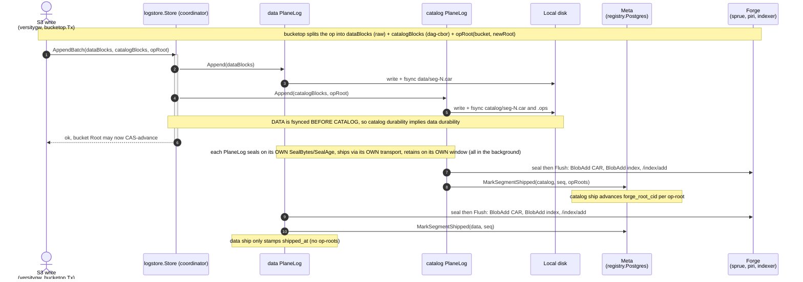
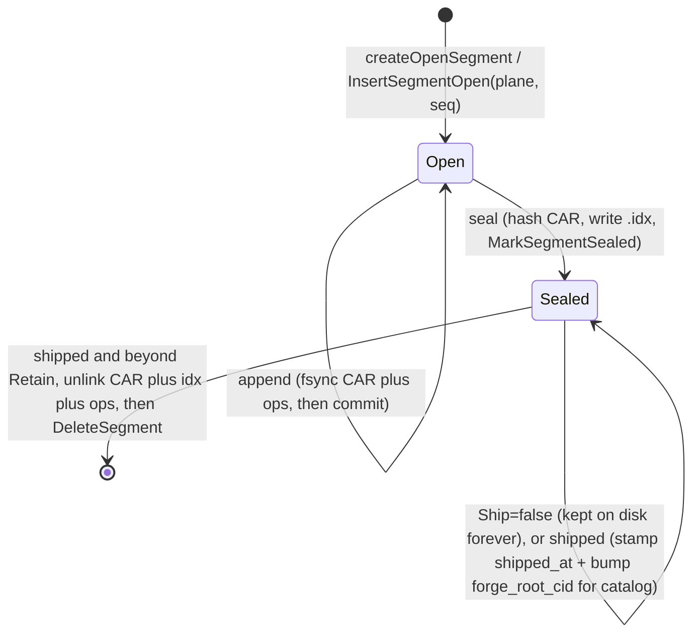

# logstore

`logstore` is ingot's **LSM-style journal** — the local, durable tier between the
S3 write path and the Forge network. Every S3 mutation lands here first
(`AppendBatch`), is fsynced to disk before the write is acked, and is later
**sealed** and **shipped** to Forge asynchronously. Reads consult the journal
before falling through to the network blockstore.

The data plane and catalog plane are **two independent pipelines** — each an
instance of one reusable module, `PlaneLog`, configured differently — sitting
under a thin coordinator, `Store`:

- **data plane** — raw-codec object-body chunks (the bytes a client GETs).
- **catalog plane** — the dag-cbor MST nodes, `ObjectManifest`s, and chunk
  indexes describing where the body bytes live and how to reconstruct an object.

Each plane has its **own** seal trigger, ship transport, and retention window, so
(for example) the catalog can be configured never to ship — retained on local
disk forever — while the data plane ships and retires. Blocks are classified by
CID codec at staging time (`cid.Raw` → data, dag-cbor → catalog; see
`OpStaging.Put`), and `Store` routes reads back to the owning plane the same way.

`*Store` implements `blockstore.Log`. The persistence backend (`Meta`) is
`*registry.Postgres` in production and an in-memory fake in tests — logstore never
touches SQL directly.

## On-disk layout

Each plane owns a subdirectory; a segment is a single CAR + its `.idx` sidecar
(catalog segments also carry the shared-per-op `.ops` sidecar):

```
<DataDir>/segments/
  data/
    seg-<N>.car   seg-<N>.idx
  catalog/
    seg-<N>.car   seg-<N>.idx   seg-<N>.ops
```

| File | Contents |
|---|---|
| `seg-N.car` | CARv1 of this plane's blocks |
| `seg-N.idx` | JSON sidecar: `cid` → `offset,length`, size, sha256, sealed_at (catalog also lists op-roots) |
| `seg-N.ops` | catalog only: append-only log of per-batch `(bucket, newRoot)` records (length-prefixed CBOR) |

`N` is the zero-padded segment id from one **shared** allocator (`ingot.segment_seq`),
so ids are globally unique across planes; the segment row's `plane` column
discriminates. Each CAR carries a placeholder header root; the real MST roots
live in the `.ops` sidecar (and the catalog `.idx`).

## Write path (the coordinator)



## Segment lifecycle (one plane)

A segment belongs to exactly one plane. The two planes run two of these
lifecycles independently — a never-ship plane simply stays in the `Sealed`
state on disk forever.



## Invariants

- **Durability barrier + ordering.** `Segment.append` fsyncs its CAR (and `.ops`
  for catalog) before committing the in-memory index. `Store.AppendBatch` appends
  **data before catalog**, so a crash never leaves a durable catalog entry
  (op-root / MST node) referencing non-durable data. A successful `AppendBatch`
  is what licenses the caller's bucket-root CAS.
- **Independent sealing/shipping/retention.** Each plane seals on its own
  `SealBytes`/`SealAge`, ships through its own `Flush`, and retains its own
  `Retain` window. A non-shipping plane has no flush worker and is never retired.
- **`forge_root_cid` advances only on the catalog ship.** MST roots are catalog
  nodes, so op-roots live only on catalog segments and only the catalog
  `MarkSegmentShipped` advances `forge_root_cid`; data ships just stamp
  `shipped_at`.
- **Byte-presence ≠ locator-presence.** The transport publishes the
  sharded-dag-index on *every* ship, independent of whether the bytes were
  already present. (Carried into the future direct-to-piri data path.)
- **The catalog is location-free.** Manifests/MST reference data only by CID;
  location resolves via the indexer at read time, never embedded in the DAG.

## Reads & tiers

`Store.Get` routes by CID codec to the owning `PlaneLog`, which checks its open
segment then its sealed segments newest-first (`ReadAt` on the CAR). A miss —
including a plane retired off disk — returns `ErrNotFound`, and the layered reader
(`blockstore.Layered`) falls through to the network tier (`blockstore.Forge`:
indexer locate, then ranged piri retrieve). LSM tiers: **hot** = open segment,
**warm** = sealed-and-local, **cold** = shipped (served from Forge once retired).

## Crash recovery

`openPlaneLog` calls `recover` per plane, reconciling its subdirectory against the
`Meta` rows before any worker starts. Discovery keys on the CAR file:

| `Meta` row | On-disk CAR | Action |
|---|---|---|
| `open` | present | `rebuildOpenFromDisk` (scan + truncate any torn trailing frame); **force-sealed** by `openPlaneLog` |
| `sealed` | present | `loadSealedFromIdx`; re-enqueue when shipping and not yet shipped |
| none | present | orphan (crashed before the row, or a row-lost sealed segment): rebuild as open + `InsertSegmentOpen`, then force-sealed |
| present | absent | delete the row |
| — | sidecar only (`.idx`/`.ops`, no CAR) | stray; unlink |

A recovered open segment is always force-sealed, so each process starts with a
brand-new open segment per plane.

## Configuration

```go
type Config struct {
    Dir     string       // <Dir>/data and <Dir>/catalog hold each plane's segments
    Meta    Meta         // persistence backend (registry.Postgres / fake)
    Data    PlaneConfig
    Catalog PlaneConfig
    Logger  *zap.Logger
}

type PlaneConfig struct {
    SealBytes int64        // open-segment CAR size threshold (0 → 64 MiB)
    SealAge   time.Duration// max age before sealing (0 → 5s); also paces the seal ticker (SealAge/4)
    Ship      bool         // false → never ship, retained forever
    Flush     FlushFunc    // ships one sealed CAR; required when Ship
    Retain    int          // shipped CARs kept locally (0 → 6); ignored when !Ship
}
```

The host (`server.go`) binds each plane's `Flush` via `newPlaneFlushFunc(uploader,
plane)`, which builds a `uploader.CARShard` from the single-plane `Segment`
accessors and calls `uploader.SubmitShard`.

## Key symbols

| Where | Symbols |
|---|---|
| `store.go` | `Store` (coordinator): `Open`, `AppendBatch` (data-before-catalog), codec-routed `Get`, `Close` |
| `planelog.go` | `PlaneLog` (one plane's pipeline): `openPlaneLog`, `Append`, `Get`, `Close`; `sealOpenIfDue`, `flushLoop`, `flushOne`, `runRetention`, `sealTickerLoop` |
| `segment.go` | single-plane `Segment`: `createOpenSegment`, `append`, `seal`, `markShipped`, `retire`, `get`; `.idx`/`.ops` codecs |
| `recovery.go` | `(*PlaneLog).recover` (per-plane disk↔`Meta` reconciliation) |
| `types.go` | `State`, `SegmentMeta` (single-plane), `Meta` (plane-scoped) |
| `config.go` | `Config`, `PlaneConfig`, `FlushFunc` |
| `../server.go` | `newPlaneFlushFunc` (plane flush → `uploader.SubmitShard`) |
| `../uploader/forge.go` | `Uploader`, `CARShard`, `Forge.SubmitShard` |
```
